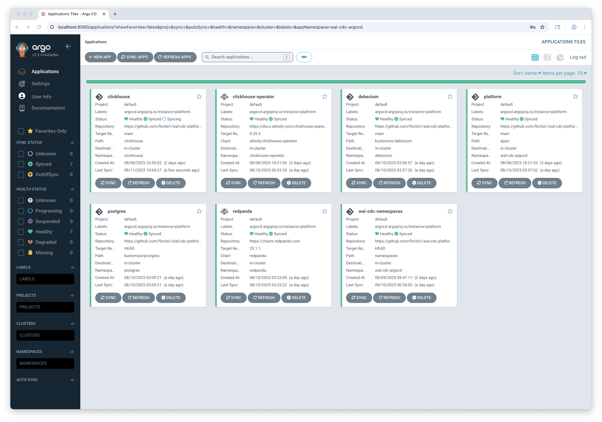

# WAL-CDC → OLAP + Lakehouse Pipeline

This project simulates a real-time OLAP platform built on PostgreSQL WAL-based CDC, streaming through Redpanda/Debezium into ClickHouse for low-latency analytics, while dual-sinking into Iceberg/S3 for lakehouse storage. It’s deployed Kubernetes-first on AWS EKS with Terraform + Argo CD, fully observable end-to-end, and extended with Trino federation, dbt semantic models, and Flink SQL stream processing.


> Purpose-built for modern SaaS data workloads: real-time ingestion, OLAP exploration, hybrid OLAP+vector search, and automated observability.

---

## 🧱 Architecture

```
PostgreSQL (WAL, tuned for CDC)
     ↓
Debezium (CDC connector)
     ↓
Redpanda (Kafka-compatible broker)
     ↓
Go Ingestion Service (dual mode: synthetic | CDC)
     ↙                          ↘
ClickHouse (ReplacingMergeTree)   Iceberg/S3 (via Flink SQL)
                ↓
         Trino Federation
                ↓
   OLAP + Lakehouse + AI/Vector Search
```

### Component Summary

| Component               | Role                                                                                   |
|--------------------------|----------------------------------------------------------------------------------------|
| **PostgreSQL**           | Source of truth; WAL tuned for logical replication                                     |
| **Debezium**             | Captures WAL changes and publishes CDC events into Redpanda                            |
| **Redpanda**             | Kafka-compatible message broker for buffering and fan-out of CDC streams               |
| **Go Ingestion Service** | Dual-mode: generates synthetic events or consumes Debezium CDC events and inserts into sinks |
| **ClickHouse**           | Real-time OLAP storage; `ReplacingMergeTree` tables for deduplication and versioning    |
| **Flink SQL**            | Processes Debezium CDC with event-time semantics, de-dupe, and exactly-once writes into Iceberg |
| **Iceberg/S3**           | Lakehouse storage; durable, append-only tables for federated querying                   |
| **Trino**                | Federated SQL query layer across PostgreSQL, ClickHouse, and Iceberg/S3                 |
| **dbt**                  | Models, semantic layers, incremental marts, and data quality tests (on ClickHouse/Trino)|
| **Observability Stack**  | Prometheus SDK + Grafana Alloy (metrics), Tempo (traces), Loki (logs), Pixie (live debugging), VictoriaMetrics (retention) |
| **Argo CD / Terraform**  | GitOps + Infrastructure as Code for Kubernetes-first provisioning and lifecycle management |
| **KEDA**                 | Autoscaling CDC consumers based on Redpanda lag                                         |


---

## 🔧 Infrastructure

- **Cluster Name:** `postgres-wal-cdc-cluster`
- **Provisioning:** Terraform (modular, destroyable)
- **Delivery:** GitOps via Argo CD
- **Infrastructure Stack:**
  - VPC
  - EKS
  - IAM
  - Argo CD
- **Teardown:** Full `terraform destroy` support

---
## 🚦 Argo CD Setup

This project uses Argo CD as the GitOps controller to deploy and manage all workloads in a **controlled, dependency-aware sequence**.

### **App of Apps pattern**
- The **`apps/root.yaml`** manifest is the “root” Argo CD Application.
- Syncing this single application cascades into all other component applications (`postgres.yaml`, `redpanda.yaml`, `debezium.yaml`, `clickhouse.yaml`, etc.).
- Centralizes version control for the entire CDC stack.

### **Sync Waves**
- Components deploy in **numbered sync waves** to ensure dependencies are ready before dependents run:
  - **Wave 0:** Namespace creation (`wal-cdc-namespaces` job)
  - **Wave 1:** Postgres
  - **Wave 2:** Stateful services (Redpanda)
  - **Wave 3:** Connectors (Debezium)
  - **Wave 4:** Clickhouse Operator
  - **Wave 5:** ClickHouseInstallation

### **Namespace Bootstrap Job**
- `apps/wal-cdc-namespaces.yaml` runs as a pre-step to create all required namespaces (`postgres`, `redpanda`, `debezium`, `clickhouse`) before any Helm releases or Kustomize deployments.
- Prevents race conditions where Argo CD tries to deploy workloads into namespaces that don’t yet exist.

### **Post-Sync Hooks**
- **Debezium** uses a PostSync hook to register the PostgreSQL connector only after the Kafka Connect workload is healthy.
  - The hook (*debezium/job-register-connector.yaml*) applies the connector configuration from *configmap-connector.json.yaml*.
  - This ensures the connector is created automatically and reliably, without requiring any manual registration steps.

### **Benefits**
- Declarative, reproducible environment setup
- Automated dependency ordering via sync waves
- Fully bootstrapped namespaces and DB initialization without manual steps
- One-click/full-stack deployment from the Argo CD UI

---
## 📦 Project Structure
```
wal-cdc-platform/
├── README.md
│
├── apps/                              # Argo CD Application CRs (App-of-Apps model)
│   ├── clickhouse-operator.yaml
│   ├── clickhouse.yaml
│   ├── debezium.yaml
│   ├── flink.yaml
│   ├── grafana.yaml
│   ├── postgres.yaml
│   ├── redpanda.yaml
│   ├── root.yaml
│   ├── trino.yaml
│   ├── vector-search.yaml
│   └── wal-cdc-namespaces.yaml
│
├── clickhouse/                        # Altinity Operator CRDs + init SQL
│   ├── clickhouseinstallation.yaml
│   ├── init-configmap.yaml
│   └── init-job.yaml
│
├── dbt/                               # dbt project for models, marts, semantic layers
│   ├── models/
│   ├── seeds/
│   ├── snapshots/
│   └── dbt_project.yml
│
├── flink/                             # Flink SQL + jobs for Iceberg sink
│   ├── jobs/
│   │   ├── normalize-cdc.sql
│   │   └── dedupe-stream.sql
│   └── flinkdeployment.yaml
│
├── ingestion-service/                 # Go ingestion service (dual-mode: synthetic + CDC)
│   ├── charts/                        # Helm chart
│   ├── cmd/
│   ├── internal/
│   ├── Dockerfile
│   └── main.go
│
├── kustomize/                         # Base configs for Debezium + Postgres
│   ├── debezium/
│   │   ├── configmap-connector.json.yaml
│   │   ├── deployment.yaml
│   │   ├── job-register-connector.yaml
│   │   ├── kustomization.yaml
│   │   ├── secret-postgres.yaml
│   │   └── service.yaml
│   └── postgres/
│       ├── configmap-init.sql.yaml
│       ├── deployment.yaml
│       ├── kustomization.yaml
│       └── service.yaml
│
├── namespaces/                        # Kubernetes namespaces for operators + apps
│   ├── clickhouse-operator.yaml
│   ├── clickhouse.yaml
│   ├── debezium.yaml
│   ├── flink.yaml
│   ├── observability.yaml
│   ├── postgres.yaml
│   └── redpanda.yaml
│
├── observability/                     # Monitoring + tracing + logging
│   ├── alloy/                         # Grafana Alloy configs
│   ├── grafana/                       # Dashboards + provisioning
│   ├── loki/                          # Logging stack
│   ├── tempo/                         # Distributed tracing
│   ├── victoria-metrics/              # Long-term metrics storage
│   └── pixie/                         # Live Kubernetes debugging
│
└── terraform/                         # Infra as Code (AWS EKS + networking)
    ├── environments/
    │   └── dev/
    │       ├── argocd.tf
    │       ├── eks.tf
    │       ├── iam.tf
    │       ├── providers.tf
    │       ├── variables.tf
    │       └── vpc.tf
    │
    └── modules/
        ├── argocd/
        │   ├── main.tf
        │   ├── outputs.tf
        │   └── values.yaml
        ├── eks/
        │   ├── main.tf
        │   ├── outputs.tf
        │   └── variables.tf
        ├── iam/
        │   ├── main.tf
        │   ├── outputs.tf
        │   └── variables.tf
        └── vpc/
            ├── main.tf
            ├── outputs.tf
            └── variables.tf

```

---

## 🔍 Under the Hood — How It Works

This project simulates a real-time OLAP + Lakehouse pipeline using PostgreSQL WAL-based change data capture, Redpanda buffering, and a dual-mode Go ingestion service that writes into ClickHouse for OLAP and Iceberg/S3 for lakehouse storage. The entire stack is deployed Kubernetes-first via GitOps on AWS EKS.
Infrastructure is provisioned with Terraform (EKS cluster, VPC, IAM, Argo CD) using modular code and remote state. Supports full teardown with terraform destroy.
- PostgreSQL is patched for logical replication; inserts/updates emit WAL changes.
- Debezium streams those WAL changes into Redpanda using Kafka-compatible protocols.
- Redpanda buffers CDC streams and fans out events for downstream consumers.
- Go Ingestion Service supports two modes:
     - mode=synthetic (default): generates mock UserEvent payloads for testing and observability.
     - mode=cdc: consumes Debezium envelopes from Redpanda, normalizes into UserEvent structs, and inserts into sinks.
- ClickHouse stores CDC events in ReplacingMergeTree tables for deduplication, versioning, and low-latency OLAP queries.
- Flink SQL processes Debezium CDC with event-time watermarks, PK-based de-dupe, and exactly-once writes into Iceberg/S3.
- Iceberg/S3 acts as the lakehouse layer for durable storage and federated queries.
- Trino unifies queries across PostgreSQL, ClickHouse, and Iceberg, enabling hybrid OLTP–OLAP analysis and vector/semantic queries.
- dbt layers semantic models, marts, and data tests on top of ClickHouse/Trino.
- Observability is first-class:
Metrics (Prometheus SDK → Grafana Alloy → VictoriaMetrics)
Traces (OpenTelemetry → Tempo)
Logs (structured logs → Alloy → Loki)
Live debugging (Pixie in-cluster).
- KEDA autoscaling adjusts ingestion service replicas based on Redpanda lag.
- Helm charts manage all workloads (ClickHouse, Debezium, Redpanda, Flink, Trino, ingestion service, observability) and are delivered declaratively via Argo CD.

---

## 🖥️ CDC Verification




### **1. PostgreSQL WAL Settings**
Snippet from kustomize/postgres/deployment.yaml
```bash
          args:
            - "-c"
            - "wal_level=logical"
            - "-c"
            - "max_wal_senders=10"
            - "-c"
            - "max_replication_slots=10"
```

---

### **2. Verify Debezium Connector Status**
```bash
# Replace host with your Debezium service DNS or port-forwarded localhost
curl -s http://connect:8083/connectors/postgres-appdb-connector/status
```
Expected RUNNING status:
``` json
{
  "name": "postgres-appdb-connector",
  "connector": {
    "state": "RUNNING",
    "worker_id": "10.2.0.250:8083"
  },
  "tasks": [
    {
      "id": 0,
      "state": "RUNNING",
      "worker_id": "10.2.0.250:8083"
    }
  ],
  "type": "source"
}
```

---

### **3. Verify Redpanda CDC Events**
```bash
# Consume a few messages from the CDC topic
kubectl -n redpanda run kafkactl --restart=Never -it --image=bitnami/kafka:3.7.0 -- \                         
  kafka-topics.sh --list --bootstrap-server redpanda.redpanda.svc.cluster.local:9093
```
Example output:
```json
{
  "topic": "dbserver1.app.users",
  "key": "{\"id\":2}",
  "value": "{\"before\":null,\"after\":{\"id\":2,\"name\":\"TestUser\",\"email\":\"test+upd@example.com\"},\"source\":{\"version\":\"2.6.2.Final\",\"connector\":\"postgresql\",\"name\":\"dbserver1\",\"ts_ms\":1754816578832,\"snapshot\":\"false\",\"db\":\"appdb\",\"sequence\":\"[\\\"26619888\\\",\\\"26619888\\\"]\",\"ts_us\":1754816578832901,\"ts_ns\":1754816578832901000,\"schema\":\"app\",\"table\":\"users\",\"txId\":759,\"lsn\":26619888,\"xmin\":null},\"op\":\"u\",\"ts_ms\":1754816579296,\"ts_us\":1754816579296122,\"ts_ns\":1754816579296122309,\"transaction\":null}",
  "timestamp": 1754816579456,
  "partition": 0,
  "offset": 2
}
```

---

## 🔑 Helpful Commands

### Get Argo CD UI Password
```bash
kubectl -n wal-cdc-argocd get secret argocd-initial-admin-secret   -o jsonpath='{.data.password}' | base64 -d; echo
```
